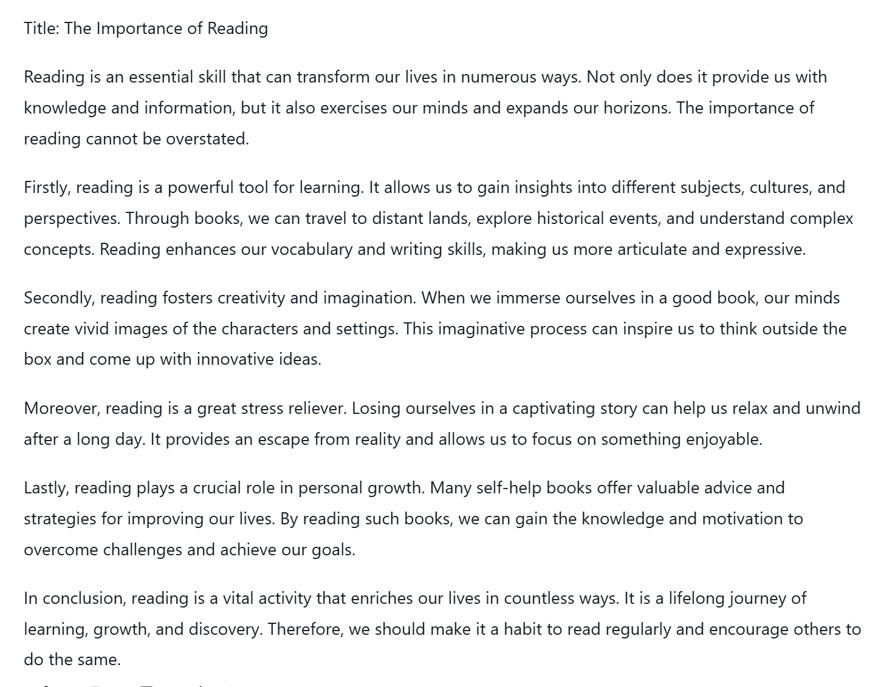
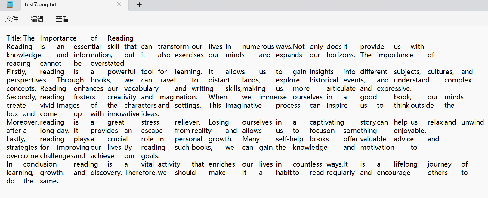

# Language Select

[中文简体](readme.md)\\[English](readme_en.md)

# Tesseract OCR Simple Application

This program utilizes Python and the pytesseract library to recognize text within images and print it in specified formats. Key features include:

- **High Accuracy**: Grayscale and binary transformations enhance image quality and OCR accuracy.
- **Flexible Output**: Choose between "original" or "line by line" printing options.
- **Multiple Image Support**: Process multiple image files simultaneously.

## Installation

1. Install dependencies:

   ```
   pip install -r requirements.txt
   ```

2. Install Tesseract OCR and configure system environment variables.

   - [Tesseract OCR Installation](https://tesseract-ocr.github.io/tessdoc/Installation.html)

## Usage

1. Modify the image path in `main.py`.
2. Run `main.py`.

## Results

**Input Image**:

**Recognition Result**:



**Note**: This application performs better with English text. Chinese recognition is slightly less accurate, and artistic fonts are not supported.